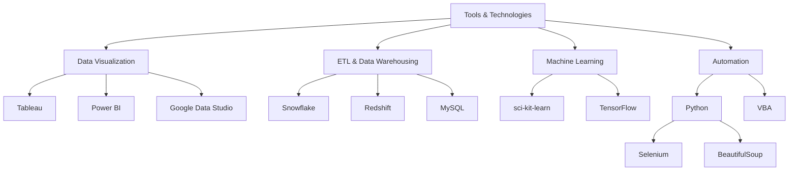

# Vignesh - Data Analyst & Business Management Professional 👨‍💼📊

## 👋 Hello, World!

I am Vignesh, a dynamic Data Analyst and Business Management Strategist with over 6 years of progressive experience, specializing in transforming raw data into actionable intelligence that fuels business growth. Throughout my career at industry giants such as Amazon and StackAdapt, I have refined my ability to dissect complex datasets, craft strategic insights, and deploy data-driven solutions that directly influence organizational success. My expertise lies at the intersection of analytical rigor and business acumen, enabling me to bridge the gap between data analysis and impactful decision-making

## 🚀 Current Focus

- **Programmatic Analyst at StackAdapt:** Delivering customized campaign performance reports and actionable insights for 40+ brands across diverse industries.
- **Machine Learning and Advanced Analytics:** Hands-on experience with Python (Pandas, Matplotlib, BeautifulSoup, Selenium) and R for data analysis, and leveraging SQL and tools like Snowflake, Databricks, and Redshift to manage and process large datasets.

## 💼 Skills & Expertise

| Area | Skills |
|------|--------|
| Data Analysis & BI | SQL (MySQL, Redshift, Snowflake), Tableau, Power BI, Google Data Studio |
| Programming | Python, R, VBA |
| Campaign Optimization | Advanced queries, Machine learning for audience segmentation |
| Project Management | Team leadership, Process automation, Operational efficiency |

## 🛠️ Tools & Technologies

## 🔗 Connect with Me

- [LinkedIn](https://www.linkedin.com/in/h-vignesh/)
- [GitHub Portfolio](https://github.com/Vignesh-Hariharan)
- [Tableau Public Profile](https://public.tableau.com/profile/vignesh.hariharan4351/)
